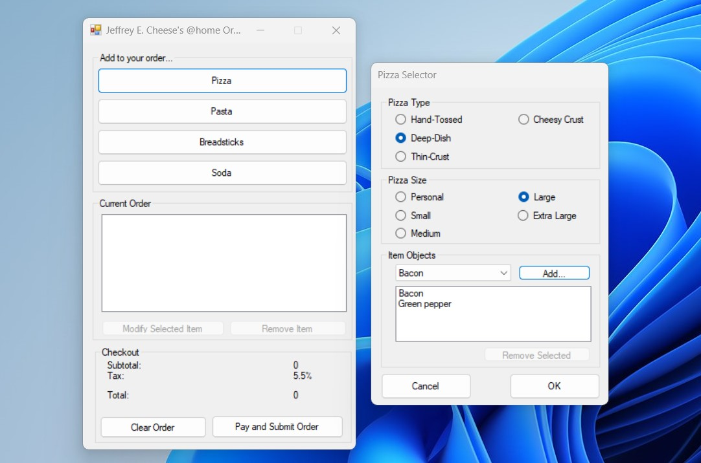

# IS304 - Pizza Project

This project was created to demonstrate business programming competency to skip the [IS304 - Fundamentals of Business Programming](https://catalog.uwec.edu/courses/is/) course at the University of Wisconsin - Eau Claire. It was created in 2017 in less than 24 hours.

It has been uploaded and archived to GitHub for posterity.

